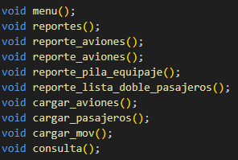

# MANUAL TECNICO
# LAB. ESTRUCTURAS DE DATOS SECCION A
## PRACTICA
### VACACIONES JUNIO 2024

```js
👻💀💀💀💀💀💀💀💀💀💀💀💀💀💀💀💀💀💀👻
💀                                           💀
💀   Universidad San Carlos de Guatemala     💀
💀   Programador: Josué Nabí Hurtarte Pinto  💀   
💀   Carnet: 202202481                       💀       
💀   Correo: josuepinto013@gmail.com         💀   
💀                                           💀       
👻💀💀💀💀💀💀💀💀💀💀💀💀💀💀💀💀💀💀👻
```
---
## Descripcion general del proyecto
<p style="text-align: justify;">
Se desarrollo un sistema de gestión de aeropuerto utilizando C++. El objetivo principal es aplicar los conocimientos sobre estructuras de datos lineales y el uso de memoria dinámica mediante apuntadores. Se gestionaron vuelos, pasajeros y equipajes usando listas enlazadas, listas circulares, pilas y colas. La aplicación, ejecutada desde una consola, permitirá la simulación de la llegada de aviones y pasajeros, así como la generación de reportes usando Graphviz. Los aviones se almacenarán en listas circulares dobles, mientras que los pasajeros y su equipaje se manejarán con colas y pilas, respectivamente.
</p>

---

## Requerimientos mínimos del entorno de desarrollo
* IDE (Entorno de Desarrollo Integrado) en nuestro caso usamos el editor de texto Visual Studio Code.
* C++ (Instalando las extensiones en Visual Studio Code).
* Libreria para lectura de json  [Link de Repositorio](https://github.com/open-source-parsers/jsoncpp).
* Graphviz 
* Git: Es muy recomendable un control de versiones para gestionar y no perder cambios.


---
# CLASES Y SUS METODOS

## Clase Avion
* Constructor: Inicializa un objeto Avion con todos sus atributos dados, incluyendo el número de vuelo, número de registro, modelo, fabricante, año de fabricación, capacidad de pasajeros, peso máximo de despegue, aerolínea y estado del avión.

* Métodos Getters: Proporciona métodos públicos para obtener los valores de cada atributo privado de la clase, tales como el número de vuelo, número de registro, modelo, fabricante, año de fabricación, capacidad, peso máximo de despegue, aerolínea y estado.

* Destructor: Define un destructor para la clase Avion, aunque en este caso no * realiza ninguna acción específica ya que no hay recursos dinámicos que necesiten liberarse explícitamente.

* Atributos privados: Almacena datos específicos de cada avión como variables privadas, incluyendo el número de vuelo, número de registro, modelo, fabricante, año de fabricación, capacidad de pasajeros, peso máximo de despegue, aerolínea y estado.


```c++
class Avion{
public:
  // Constructor
  Avion(const std::string &vuelo, const std::string &numeroRegistro, const std::string &modelo,const std::string &fabricante, int anoFabricacion, int capacidad, int pesoMaxDespegue,const std::string &aerolinea, const std::string &estado): vuelo(vuelo), numeroRegistro(numeroRegistro), modelo(modelo), fabricante(fabricante),anoFabricacion(anoFabricacion), capacidad(capacidad), pesoMaxDespegue(pesoMaxDespegue),aerolinea(aerolinea), estado(estado) {}

  // Getters
  std::string getVuelo() const { return vuelo; }
  std::string getNumeroRegistro() const { return numeroRegistro; }
  std::string getModelo() const { return modelo; }
  std::string getFabricante() const { return fabricante; }
  int getAnoFabricacion() const { return anoFabricacion; }
  int getCapacidad() const { return capacidad; }
  int getPesoMaxDespegue() const { return pesoMaxDespegue; }
  std::string getAerolinea() const { return aerolinea; }
  std::string getEstado() const { return estado; }

  ~Avion() {}

// private data members
private:
  std::string vuelo;
  std::string numeroRegistro;
  std::string modelo;
  std::string fabricante;
  int anoFabricacion;
  int capacidad;
  int pesoMaxDespegue;
  std::string aerolinea;
  std::string estado;
};
```
---
## Clase Pasajero

* Constructor: Inicializa un objeto Pasajero con todos sus atributos dados, incluyendo el nombre, nacionalidad, número de pasaporte, número de vuelo, número de asiento, destino, origen y cantidad de equipaje facturado.

* Métodos Getters: Proporciona métodos públicos para obtener los valores de cada atributo privado de la clase, tales como el nombre, nacionalidad, número de pasaporte, número de vuelo, número de asiento, destino, origen y cantidad de equipaje facturado.

* Destructor: Define un destructor para la clase Pasajero, aunque en este caso no realiza ninguna acción específica ya que no hay recursos dinámicos que necesiten liberarse explícitamente.

* Atributos privados: Almacena datos específicos de cada pasajero como variables privadas, incluyendo el nombre, nacionalidad, número de pasaporte, número de vuelo, número de asiento, destino, origen y cantidad de equipaje facturado.

```c++
class Pasajero {
public:
    // Constructor
    Pasajero(const std::string &nombre, const std::string &nacionalidad, const std::string &numero_de_pasaporte,const std::string &vuelo, const std::string &asiento, const std::string &destino,const std::string &origen, const int &equipaje_facturado): nombre(nombre), nacionalidad(nacionalidad), numero_de_pasaporte(numero_de_pasaporte), vuelo(vuelo),asiento(asiento), destino(destino), origen(origen), equipaje_facturado(equipaje_facturado) {}
    
    // Getters
    std::string getNombre() const { return nombre; }
    std::string getNacionalidad() const { return nacionalidad; }
    std::string getNumeroDePasaporte() const { return numero_de_pasaporte; }
    std::string getVuelo() const { return vuelo; }
    std::string getAsiento() const { return asiento; }
    std::string getDestino() const { return destino; }
    std::string getOrigen() const { return origen; }
    int getEquipajeFacturado() const { return equipaje_facturado; }

    ~Pasajero() {}

// private data members
private:
    std::string nombre;
    std::string nacionalidad;
    std::string numero_de_pasaporte;
    std::string vuelo;
    std::string asiento;
    std::string destino;
    std::string origen;
    int equipaje_facturado;
};
```
---
## MAIN 



* menu(): Esta función imprime un menú en la consola con varias opciones para el usuario, como carga de aviones, carga de pasajeros, etc. Espera la entrada del usuario para seleccionar una opción.

* cargar_aviones(): Lee datos de un archivo JSON llamado "aviones.json", crea objetos Avion con estos datos y los inserta en una lista circular doble dependiendo de su estado (Disponible o Mantenimiento).

* cargar_pasajeros(): Lee datos de un archivo JSON llamado "pasajeros.json", crea objetos Pasajero con estos datos y los encola en una estructura tipo Cola (colaPasajeros).

* cargar_mov(): Lee movimientos desde un archivo de texto "movimientos.txt". Los movimientos pueden ser ingreso de equipajes a una pila (equipajePasajeros) y cambios de estado de aviones entre Disponible y Mantenimiento en las listas dobles circulares.

* consulta(): Permite al usuario buscar un pasajero por número de pasaporte en una lista doblemente enlazada de pasajeros (listaEquipaje). Si encuentra al pasajero, muestra sus datos.

* reportes(): Presenta un menú de opciones para generar diferentes tipos de reportes, como lista de aviones disponibles, cola de registro de pasajeros, pila de equipaje y lista doble de pasajeros. Cada opción llama a una función específica para generar y guardar un reporte en formato DOT.

* reporte_aviones(): Genera un reporte visual de los aviones disponibles y en mantenimiento utilizando Graphviz. Crea archivos DOT y PNG que muestran los aviones como nodos con conexiones entre ellos según su estado.

* reporte_pila_equipaje(): Genera un reporte visual de la pila de equipaje utilizando Graphviz. Crea un archivo DOT y PNG que muestra cada elemento de la pila como un nodo y las conexiones entre ellos.

* reporte_lista_doble_pasajeros(): Genera un reporte visual de la lista doble de pasajeros utilizando Graphviz. Crea un archivo DOT y PNG que muestra cada pasajero como un nodo y las conexiones entre ellos en la lista.

---
# ESTRUCTURAS

## LISTA DOBLE CIRCULAR

* Constructor y Destructor: El constructor inicializa una lista circular doblemente enlazada vacía. El Destructor libera la memoria ocupada por todos los nodos en la lista, llamando al método clear().


* insert: Inserta un nuevo nodo con el valor value al final de la lista. Si la lista está vacía, el nuevo nodo se convierte en el primer y último nodo. Si no está vacía, el nuevo nodo se inserta al final y los punteros next y prev se actualizan adecuadamente para mantener la estructura circular.

* remove: Elimina el primer nodo que contiene el valor value. Si el nodo a eliminar es el único nodo en la lista, se actualizan first y last a nullptr. Si es el primer nodo, se actualiza first al siguiente nodo. Si es el último nodo, se actualiza last al nodo anterior. Si está en el medio, los punteros next y prev de los nodos vecinos se actualizan adecuadamente.

* getSize: Devuelve el número de elementos en la lista.

* getElement: Devuelve el valor del nodo en la posición especificada por indice. Si el índice está fuera de rango, lanza una excepción.

* isEmpty: Verifica si la lista está vacía.

* Clear: Elimina todos los nodos de la lista y libera la memoria correspondiente, dejando la lista vacía.

*  print: Imprime los valores de todos los nodos en la lista en orden, Si la lista está vacía, imprime un mensaje indicando que la lista está vacía.

* buscarPorNumeroDeRegistro: Busca un nodo por su número de registro y devuelve un puntero al nodo que contiene el número de registro especificado.

* eliminarPorNumeroDeRegistro: Elimina el nodo que contiene el número de registro especificado.

```c++
template <typename type>
struct Nodo {
    type data;
    Nodo<type>* next;
    Nodo<type>* prev;

    Nodo(const type& value) : data(value), next(nullptr), prev(nullptr) {}
};

template <typename type>
class DoubleCircularList {
private:
    Nodo<type>* first;
    Nodo<type>* last;
    int size;

public:
    DoubleCircularList() : first(nullptr), last(nullptr), size(0) {}

    ~DoubleCircularList() {
        clear();
    }

    void insert(const type& value) {
        Nodo<type>* nuevoNodo = new Nodo<type>(value);
        if (isEmpty()) {
            first = nuevoNodo;
            last = nuevoNodo;
            nuevoNodo->next = nuevoNodo;
            nuevoNodo->prev = nuevoNodo;
        } else {
            nuevoNodo->prev = last;
            nuevoNodo->next = first;
            last->next = nuevoNodo;
            first->prev = nuevoNodo;
            last = nuevoNodo;
        }
        size++;
    }

    void remove(const type& value) {
        if (isEmpty()) {
            return;
        }
        Nodo<type>* actual = first;
        do {
            if (actual->data == value) {
                if (actual == first && actual == last) {
                    first = nullptr;
                    last = nullptr;
                } else if (actual == first) {
                    first = actual->next;
                    last->next = first;
                    first->prev = last;
                } else if (actual == last) {
                    last = actual->prev;
                    last->next = first;
                    first->prev = last;
                } else {
                    actual->prev->next = actual->next;
                    actual->next->prev = actual->prev;
                }
                delete actual;
                size--;
                return;
            }
            actual = actual->next;
        } while (actual != first);
    }

    int getSize() const {
        return size;
    }

    type getElement(int indice) const {
        if (indice < 0 || indice >= size) {
            throw std::out_of_range("Fuera de rango");
        }
        Nodo<type>* actual = first;
        for (int i = 0; i < indice; i++) {
            actual = actual->next;
        }

        return actual->data;
    }

    bool isEmpty() const {
        return size == 0;
    }

    void clear() {
        if (!isEmpty()) {
            Nodo<type>* actual = first;
            do {
                Nodo<type>* temp = actual;
                actual = actual->next;
                delete temp;
            } while (actual != first);
            first = nullptr;
            last = nullptr;
            size = 0;
        }
    }

    void print() const {
        if (isEmpty()) {
            std::cout << "Esta vacia la lista" << std::endl;
            return;
        }
        Nodo<type>* actual = first;
        do {
            std::cout << actual->data << " ";
            actual = actual->next;
        } while (actual != first);
        std::cout << std::endl;
    }


    type* buscarPorNumeroDeRegistro(const string& numeroDeRegistro) const {
        if (isEmpty()) {
            return nullptr;
        }
        Nodo<type>* actual = first;
        do {
            if (actual->data.getNumeroRegistro() == numeroDeRegistro) {
                return &(actual->data);
            }
            actual = actual->next;
        } while (actual != first);
        return nullptr;
    }

    void eliminarPorNumeroDeRegistro(const string& numeroDeRegistro) {
        if (isEmpty()) {
            return;
        }
        Nodo<type>* actual = first;
        do {
            if (actual->data.getNumeroRegistro() == numeroDeRegistro) {
                if (actual == first && actual == last) {
                    first = nullptr;
                    last = nullptr;
                } else if (actual == first) {
                    first = actual->next;
                    last->next = first;
                    first->prev = last;
                } else if (actual == last) {
                    last = actual->prev;
                    last->next = first;
                    first->prev = last;
                } else {
                    actual->prev->next = actual->next;
                    actual->next->prev = actual->prev;
                }
                delete actual;
                size--;
                return;
            }
            actual = actual->next;
        } while (actual != first);
    }
};
```

## LISTA DOBLE ENLAZADA

* Constructor y Destructor: El constructor inicializa una lista doblemente enlazada vacía, con head y tail apuntando a nullptr. El destructor Libera la memoria ocupada por todos los nodos en la lista.

* prepend: Inserta un nuevo nodo con el valor data al inicio de la lista.

* append: Inserta un nuevo nodo con el valor data al final de la lista.

* getSize: Devuelve el número de elementos en la lista.

* getElement: Devuelve el valor del nodo en la posición especificada por pos. Lanza una excepción si la posición está fuera de rango.

* eliminarDelFinal: Elimina el último nodo de la lista.

* eliminarDelInicio: Elimina el primer nodo de la lista.

* buscarPorNumeroDePasaporte: Busca un nodo por su número de pasaporte y devuelve el valor del nodo que contiene el número de pasaporte especificado. Lanza una excepción si no se encuentra.

* ordenarPorNumeroDeAsiento: Ordena los nodos de la lista en orden ascendente según el número de asiento.

* ordenarPorNumeroDeVuelo: Ordena los nodos de la lista en orden ascendente según el número de vuelo.

```c++
template <typename T>
class Node {
public:
    T data;
    Node<T>* next;
    Node<T>* prev;

    Node(T data) : data(data), next(nullptr), prev(nullptr) {}
};

template <typename T>
class DoublyLinkedList {
private:
    Node<T>* head;
    Node<T>* tail;

public:
    DoublyLinkedList() : head(nullptr), tail(nullptr) {}

    ~DoublyLinkedList() {
        Node<T>* actual = head;
        while (actual != nullptr) {
            Node<T>* next = actual->next;
            delete actual;
            actual = next;
        }
    }

    void prepend(T data) {
        Node<T>* nuevoNodo = new Node<T>(data);
        if (head == nullptr) {
            head = tail = nuevoNodo;
        } else {
            nuevoNodo->next = head;
            head->prev = nuevoNodo;
            head = nuevoNodo;
        }
    }

    void append(T data) {
        Node<T>* nuevoNodo = new Node<T>(data);
        if (tail == nullptr) {
            head = tail = nuevoNodo;
        } else {
            nuevoNodo->prev = tail;
            tail->next = nuevoNodo;
            tail = nuevoNodo;
        }
    }

    int getSize() const {
        int size = 0;
        Node<T>* actual = head;
        while (actual != nullptr) {
            size++;
            actual = actual->next;
        }
        return size;
    }

    T getElement(int pos) const {
        if (pos < 0 || pos >= getSize()) {
            throw std::out_of_range("Posición inválida");
        }
        Node<T>* actual = head;
        for (int i = 0; i < pos; i++) {
            actual = actual->next;
        }
        return actual->data;
    }

    void eliminarDelFinal() {
        if (tail != nullptr) {
            Node<T>* nodoAEliminar = tail;
            tail = tail->prev;
            if (tail != nullptr) {
                tail->next = nullptr;
            } else {
                head = nullptr;
            }
            delete nodoAEliminar;
        }
    }

    void eliminarDelInicio() {
        if (head != nullptr) {
            Node<T>* nodoAEliminar = head;
            head = head->next;
            if (head != nullptr) {
                head->prev = nullptr;
            } else {
                tail = nullptr;
            }
            delete nodoAEliminar;
        }
    }

    T buscarPorNumeroDePasaporte(const std::string& numeroDePasaporte) const {
        Node<T>* actual = head;
        while (actual != nullptr) {
            if (actual->data.getNumeroDePasaporte() == numeroDePasaporte) {
                return actual->data;
            }
            actual = actual->next;
        }
        throw std::runtime_error("No se encontró ese número de pasaporte");
    }

    void ordenarPorNumeroDeAsiento() {
        if (head == nullptr) {
            return;
        }
        Node<T>* actual = head;
        while (actual->next != nullptr) {
            Node<T>* next = actual->next;
            while (next != nullptr) {
                if (actual->data.getAsiento() > next->data.getAsiento()) {
                    T temp = actual->data;
                    actual->data = next->data;
                    next->data = temp;
                }
                next = next->next;
            }
            actual = actual->next;
        }
    }

    void ordenarPorNumeroDeVuelo() {
        if (head == nullptr) {
            return;
        }
        Node<T>* actual = head;
        while (actual->next != nullptr) {
            Node<T>* next = actual->next;
            while (next != nullptr) {
                if (actual->data.getVuelo() > next->data.getVuelo()) {
                    T temp = actual->data;
                    actual->data = next->data;
                    next->data = temp;
                }
                next = next->next;
            }
            actual = actual->next;
        }
    }
};
```

## PILA 

* Constructor y Destructor: El constructor inicializa una pila vacía, con top apuntando a nullptr. El destructor libera la memoria ocupada por todos los nodos en la pila llamando al método clear().

* push: Inserta un nuevo nodo con el valor valor en la parte superior de la pila.

* pop: Elimina el nodo en la parte superior de la pila. Muestra un mensaje de error si la pila está vacía.

* topFila: Devuelve el valor del nodo en la parte superior de la pila. Lanza una excepción si la pila está vacía.

* isEmpty: Verifica si la pila está vacía. Devuelve true si top es nullptr, de lo contrario, devuelve false.

* Clear: Elimina todos los nodos de la pila, dejándola vacía.

* getSize: Devuelve el número de elementos en la pila.

* getElement: Devuelve el valor del nodo en la posición especificada por posicion dentro de la pila. Muestra un mensaje de error si la posición está fuera de rango o es negativa.

```c++
template <typename T>
class Pila
{
private:
    struct Nodo
    {
        T data;
        Nodo *next;
    };

    Nodo *top;

public:
    Pila() : top(nullptr) {}
    ~Pila();

    void push(const T &valor);
    void pop();
    T topPila() const;
    bool isEmpty() const;
    void clear();
    int getSize(const Pila<T> &pila);
    T getElement(const Pila<T> &pila, int posicion);
};

template <typename T>
Pila<T>::~Pila()
{
    clear();
}

template <typename T>
void Pila<T>::push(const T &valor)
{
    Nodo *nuevoNodo = new Nodo{valor, top};
    top = nuevoNodo;
}

template <typename T>
void Pila<T>::pop()
{
    if (top != nullptr)
    {
        Nodo *nodoAEliminar = top;
        top = top->next;
        delete nodoAEliminar;
    }
    else
    {
        std::cerr << "Error: La pila está vacía, no se puede pop." << std::endl;
    }
}

template <typename T>
T Pila<T>::topPila() const {
    if (top != nullptr) {
        return top->data;
    } else {
        std::cerr << "Error: La pila está vacía, no se puede obtener la top." << std::endl;
        throw std::runtime_error("La pila está vacía"); // Lanza una excepción en lugar de devolver un valor por defecto
    }
}

template <typename T>
bool Pila<T>::isEmpty() const
{
    return top == nullptr;
}

template <typename T>
void Pila<T>::clear()
{
    while (!isEmpty())
    {
        pop();
    }
}

// Metodo para obtener el tamaño de la pila sin que reciba parametros
template <typename T>
int getSize(const Pila<T> &pila)
{
    int tamano = 0;
    typename Pila<T>::Nodo *nodoActual = pila.top;
    while (nodoActual != nullptr)
    {
        tamano++;
        nodoActual = nodoActual->next;
    }
    return tamano;
}


// Metodo para obtener un elemento de la pila
template <typename T>
T getElement(const Pila<T> &pila, int posicion)
{
    if (posicion < 0)
    {
        std::cerr << "Error: La posición no puede ser negativa." << std::endl;
        return T(); 
    }

    typename Pila<T>::Nodo *nodoActual = pila.top;
    for (int i = 0; i < posicion && nodoActual != nullptr; i++)
    {
        nodoActual = nodoActual->next;
    }

    if (nodoActual != nullptr)
    {
        return nodoActual->data;
    }
    else
    {
        std::cerr << "Error: La posición está fuera de rango." << std::endl;
        return T(); 
    }
};
```

## COLA

* Constructor y Destructor: El constructor inicializa una cola vacía con front y rear apuntando a nullptr y size establecido en 0. El destructor Libera la memoria ocupada por todos los nodos en la cola, llamando al método dequeue() repetidamente hasta que la cola esté vacía.

* isEmpty: Verifica si la cola está vacía. 

* getSize: Devuelve el número de elementos en la cola.

* enqueue: Inserta un nuevo nodo con el valor value en la parte trasera (final) de la cola.

* dequeue: Elimina el nodo en la parte delantera (inicio) de la cola y devuelve su valor. Lanza una excepción si la cola está vacía.

* getElement: Devuelve el valor del nodo en la posición especificada por pos dentro de la cola. Lanza una excepción si la posición está fuera de rango.

* getFront: Devuelve el valor del nodo en la parte delantera (inicio) de la cola sin eliminarlo. Lanza una excepción si la cola está vacía.

```c++
#ifndef COLA_H
#define COLA_H
#include <iostream>
#include <stdexcept>

template <typename T>
class Cola {
private:
    class Nodo {
    public:
        T value;
        Nodo* next;

        Nodo(T val) : value(val), next(nullptr) {}
    };

    Nodo* front;
    Nodo* rear;
    int size;

public:
    // Constructor
    Cola() : front(nullptr), rear(nullptr), size(0) {}

    ~Cola() {
        while (!isEmpty()) {
            dequeue();
        }
    }

    bool isEmpty() const {
        return size == 0;
    }

    int getSize() const {
        return size;
    }

    void enqueue(const T& value) {
        Nodo* nuevoNodo = new Nodo(value);
        if (isEmpty()) {
            front = rear = nuevoNodo;
        } else {
            rear->next = nuevoNodo;
            rear = nuevoNodo;
        }
        size++;
    }

    T dequeue() {
        if (isEmpty()) {
            throw std::out_of_range("La cola está vacía");
        }
        Nodo* nodoAEliminar = front;
        T value = nodoAEliminar->value;
        front = front->next;
        if (front == nullptr) {
            rear = nullptr;
        }
        delete nodoAEliminar;
        size--;
        return value;
    }

    T getElement(int pos) const {
        if (pos < 0 || pos >= size) {
            throw std::out_of_range("Posición inválida");
        }
        Nodo* actual = front;
        for (int i = 0; i < pos; i++) {
            actual = actual->next;
        }
        return actual->value;
    }

        T getFront() const {
        if (isEmpty()) {
            throw std::out_of_range("La cola está vacía");
        }
        return front->value;
    }
};
#endif 
```

